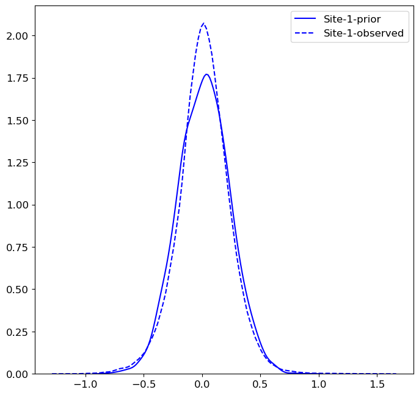

==============
neuroHarmonize
==============

Harmonization tools for multi-site neuroimaging analysis. Part of the work
reported in our first paper with data from the ISTAGING consoritum [1]_.

Overview
---------

This package extends the functionality of the package developed by Nick Cullen [2]_,
``neuroCombat``, which is hosted on GitHub: https://github.com/ncullen93/neuroCombat

The previously-released package, ``neuroCombat``, allows the user to perform a
harmonization procedure using the ComBat [3]_ algorithm for correcting
multi-site data.

This package, ``neuroHarmonize``, has similar functionality, but also allows the
user to perform additional procedures:

1. Train a harmonization model on a subset of data, then apply the model to the
   new set. For example, in longitudinal analyses, one may wish to train a
   harmonization model on baseline cases and apply the model to follow-up cases,
   to avoid double-counting subjects.
2. Specify covariates with nonlinear effects. Age tends to exhibit nonlinear
   relationships with brain volumes. Nonlinear effects are implemented using
   Generalized Additive Models (GAMs) via the ``statsmodels`` package.
3. Apply a pre-trained harmonization model to NIFTI images. When performing
   image-level harmonization, loading the entire set of images may exceed
   memory capacity. In such cases, it is still possible to harmonize images by
   sequentially adjusting images one-by-one. This functionality is made
   available via the ``nibabel`` package.
4. Train a harmonization model without the empirical Bayes (EB) step of ComBat.

Installation
------------

Latest version: ``0.3.1`` (April 2020)

Requirements:

* ``git >= 2.17.2``
* ``python >= 3.7.6``

*To make installation easier, neuroCombat is not a formal dependency for this
package, but the source code is included to call neuroCombat functions.*

**Option 1: Install from PyPI (not available yet)**

*Instructions will be written once package is released on PyPI. The package
cannot be released on PyPI until a developer version of statsmodels is released.*

**Option 2: Install from GitHub**

1. Install the developer version of ``statsmodels``. This package depends on ``statsmodels v0.12.0.dev0``. Until the dev version is released, the current workaround is to run the following in the command line:

    >>> pip install git+https://github.com/statsmodels/statsmodels
    
2. Install latest version of ``neuroHarmonize``. Run the following in the command line:

    >>> pip install git+https://github.com/rpomponio/neuroHarmonize

Quick Start
-----------

You must provide a **data matrix** which is a ``numpy.array`` containing the
features to be harmonized. For example, an ``array`` of brain volumes:

::
  
  array([[3138.0, 3164.2,  ..., 206.4],
         [1708.4, 2351.2,  ..., 364.0],
         ...,
         [1119.6, 1071.6,  ..., 326.6]])
         
The dimensionality of this matrix must be: **N_samples x N_features**

You must also provide a **covariate matrix** which is a ``pandas.DataFrame`` 
containing all covariates to control for during harmonization. All covariates
must be encoded numerically (you must handle categorical covariates in a
pre-processing step, see ``pandas.get_dummies``). The ``DataFrame`` must
also contain a single column called "SITE" with labels that identify sites
(the labels in "SITE" need not be numeric).

::

       SITE   AGE  SEX_M
  0  SITE_A  76.5      1
  1  SITE_B  80.1      1
  2  SITE_A  82.9      0
  ...   ...   ...    ...
  9  SITE_B  82.1      0
  
The dimensionality of this dataframe must be: **N_samples x N_Covariates**

The order of samples must be identical in the **covariate_matrix** and the
**data_matrix**.

After preparing both inputs, you can call ``harmonizationLearn`` to harmonize
the provided dataset.

Example usage:

    >>> from neuroHarmonize import harmonizationLearn
    >>> import pandas as pd
    >>> import numpy as np
    >>> # load your data and all numeric covariates
    >>> my_data = pd.read_csv('brain_volumes.csv')
    >>> my_data = np.array(my_data)
    >>> covars = pd.read_csv('subject_info.csv')
    >>> # run harmonization and store the adjusted data
    >>> my_model, my_data_adj = harmonizationLearn(my_data, covars)

If you wish to skip the empirical Bayes step of ComBat, simply pass the optional
argument ``eb=False`` to ``harmonizationLearn``.

Applying Pre-Trained Models to New Data
---------------------------------------

If you have previously trained a harmonization model with ``harmonizationLearn``,
you may apply the model parameters to new data with ``harmonizationApply``.

First load the model:

    >>> from neuroHarmonize import harmonizationApply, loadHarmonizationModel
    >>> import pandas as pd
    >>> import numpy as np
    >>> # load a pre-trained model
    >>> my_model = loadHarmonizationModel('../models/my_model')

Next, prepare the holdout data on which you will apply the model. This data
must look exactly like the training data for ``harmonizationLearn``, including
the same number and order of covariates. If the holdout data contains a
different number of sites, an error will be thrown.

After preparing the holdout data simply apply the model:

    >>> df_holdout = pd.read_csv('../data/brain_volumes_holdout.csv')
    >>> my_holdout_data = np.array(df_holdout)
    >>> covars = pd.read_csv('subject_info_holdout.csv')
    >>> my_holdout_data_adj = harmonizationApply(my_holdout_data, covars, my_model)

Empirical Bayes
---------------

Note the default behavior is to run the empirical Bayes (EB) step of ComBat, which
is useful for harmonizing multiple features that are similar such as genes or
brain regional volumes.

To run without EB, specify ``eb=False`` in ``harmonizationLearn``. This is
convenient when harmonizing a small number of features, e.g. fewer than 10.

Specifying Nonlinear Covariate Effects
--------------------------------------

You may specify nonlinear covariate effects with the optional argument:
``smooth_terms``. For example, you may want to specify age as a nonlinear
term in the harmonization model. This can be done easily with
``harmonizationLearn``:

    >>> from neuroHarmonize import harmonizationLearn
    >>> import pandas as pd
    >>> import numpy as np
    >>> # load your data and all numeric covariates
    >>> my_data = pd.read_csv('brain_volumes.csv')
    >>> my_data = np.array(my_data)
    >>> covars = pd.read_csv('subject_info.csv')
    >>> # run harmonization with NONLINEAR effects of age
    >>> my_model, my_data_adj = harmonizationLearn(data, covars, smooth_terms=['AGE'])

When applying nonlinear models to holdout data, you may get an error: "some data
points fall outside the outermost knots, and I'm not sure how to handle them".
This is documented: https://github.com/statsmodels/statsmodels/issues/2361. 
The current workaround is to use the optional argument: ``smooth_term_bounds``,
which controls the boundary knots for nonlinear estimation. You should specify
boundaries that contain the limits of the entire dataset, including holdout data.

Working with NIFTI Images
-------------------------

*This feature is currently in development.*

Visualize Fits of EB Priors
---------------------------

When ``eb=True``, ComBat uses Empirical Bayes to fit a prior distribution for
the site effects for each site. You may wish to visualize fit of the prior
distribution, along with the observed distribution of site effects. The following
code example plots both distributions for the location effect of site 1.

    >>> import matplotlib.pyplot as plt
    >>> import seaborn as sns
    >>> from neuroHarmonize import loadHarmonizationModel
    >>> model = loadHarmonizationModel('../models/my_model')
    >>> site_01 = stats.norm.rvs(size=10000, loc=model['gamma_bar'][0], scale=np.sqrt(model['t2'][0]))
    >>> sns.kdeplot(site_01, color='blue', label='Site-1-prior')
    >>> sns.kdeplot(model['gamma_hat'][0, :], color='blue', label='Site-1-observed', linestyle='--')
    >>> plt.show()

Citations
---------

.. [1] Pomponio, R., Shou, H., Davatzikos, C., et al., (2019).
   "Harmonization of large MRI datasets for the analysis of brain imaging
   patterns throughout the lifespan." Neuroimage 208.
   https://doi.org/10.1016/j.neuroimage.2019.116450.
.. [2] Fortin, J. P., N. Cullen, Y. I. Sheline, W. D. Taylor, I. Aselcioglu,
   P. A. Cook, P. Adams, C. Cooper, M. Fava, P. J. McGrath, M. McInnis,
   M. L. Phillips, M. H. Trivedi, M. M. Weissman and R. T. Shinohara (2017).
   "Harmonization of cortical thickness measurements across scanners and sites."
   Neuroimage 167: 104-120. https://doi.org/10.1016/j.neuroimage.2017.11.024.
.. [3] W. Evan Johnson and Cheng Li, Adjusting batch effects in microarray
   expression data using empirical Bayes methods. Biostatistics, 8(1):118-127,
   2007. https://doi.org/10.1093/biostatistics/kxj037.

    
